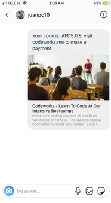
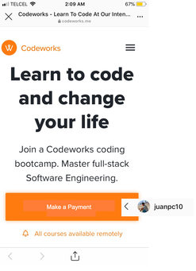
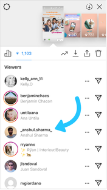
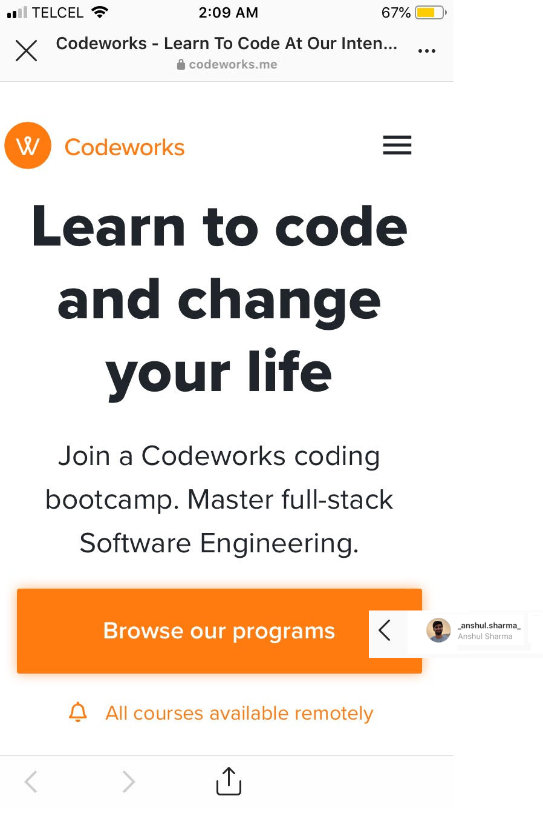

# rewrams
Rewarding customers

Rewrams is a social media reward system for customers. The application connects to a business entity database
and automates the creation plus distribution of coupons in accordance to a set of rules customizable in rewrams website.
Rewrams automates the response to customers with a coupon anytime customers share and tag the business entity account.

In other words, when a user shares a post or a story (e.g. instagram) tagging the business account 
e.g. @codeworks or @starbucks, rewrams will automatically generate and send a coupon code for 
that person e.g. 25% or 1%, depending on his campaign settings determined in rewrams user interface. 
The code is sent inmediatly to the person via the same channel the notification was sent (instagram dm) and a link to the business website where he or she can proceed to checkout by either product chosen or order type and apply the code sent.

Facebook and instagram ads are expensive. The minimum budget is around $5 dls per day to reach and average audience of 500 at the most,not considereing the type of reach out. If you do a conversion type of ad and you track the conversion with a pixel,
on average, if succesful, you get a conversion after a week or so when the pixel is maturing and facebook is optimizing
the audience to reach. This could translate to $35 dls per week for 1 conversion per week, then you can scale up and so.
This may not seem as much but it totals a $155 dls per month, for around 1 possible conversion considering a targeted niche generic product (e.g. $50 bluetooth speaker).
Fb in collaboration with instagram takes time to understand and optimize the targeting of your audience. Considering you test a certain type of ad (e.g. click type), and a certain type of audience (e.g. young adults age 18-25 with interests in music and have liked spotify,etc.), each test can cost the said amount mentioned, $155/month. The marketing cost can easily increase without having many results (e.g. $155dls/month for each of the 4 to 5 tests = -$620 for selling 1 to 3 $50 speakers).

You can reach the same outcome by using your clients social media. When you have a sale, the client is the target audience 
and as the group he engages is likely to be similar to him in terms of demographics and interests, therefore we can conclude
his social media group is to some extent your target audience as well. Allowing him to share his experience
is allowing you to advertise to the target audience you need, similar to facebook figuring out what target audience to advertise.
The difference is you can determine the price and you are also giving the benefit to the client.

Here is a quick representation of how it works:

1. Customer shares story.

2. Customer receives a dicount code.

3. Customer pays with the discount rewarded.

4. Customer's friend gets interested in codeworks.

5. Customer's friend signs up to codeworks.

APP:

A web app that automatizes the process of sending coupon codes. The automation is not specific to 
one specific scenario or account, the process can be transferable to other scenarios in other 
accounts. Ideally after a user shares a post or a story (instagram) tagging the business account 
e.g. @codeworks, the connected social media business account will send a notification to its connected 
website page, and automatically generate a coupon code for that person or user name for a standard general percentage e.g. 25%or 1%, maybe that can be changed depending on the business account and social media page linked (instagram). The code is sent inmediatly to the person via the same channel the notification was sent (instagram dm) and a link to the business website where he or she can proceed to checkout by either product chosen and apply the code sent. 

In summary, a communication between the business account social media(instagram) api and the business website and database.

To simplify, the process would be as follow: the social media account sends notification to website which 
generates random code, code text is copied and pasted to a direct message sent to social media accouny (instagram) 
acount of the user, user applies code to an order checkout he decides. 

The coupon code specifics could be one code per user for one order, coupon reward not cummulative but maybe 
customizable upon different business accounts e.g. for a given business account scenario like a crossfit gym; a user can share 
multiple posts generating multiple codes which are registered and if not used can add up to a maximum discount 
percentage of the last coupon generated. Another example could be that for another business such as a restaurant for example which product or service is different, the coupon percentage is not increased by the number of codes a user has 
generated by said actions of sharing. 

It may sound complicated but is simple, the fundamental idea is the communication of two platforms, social media account (instagram) and webpage plus database.
